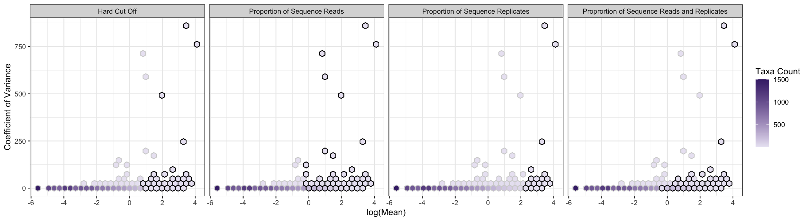

CoreMicro
=========

<!-- badges: start -->
<!-- badges: end -->

Companion package to manuscript: The hypothesis of a ‘core’ community receives poor support when confronted with simulated and empirical data. Package allows for the comparison of commonly utilized methods for assignment of taxa into core or non-core groups. Package includes tools for calculation of summary statistics for taxon abundance data and visualization of subsequent core and non-core assignments. Each of the four core assignment methods included can be customized to alter thresholds required for core inclusion. This allows researchers to alter cutoffs and determine if core assignment methods agree at certain cutoffs, facilitating comparison of multiple core assignment methods. As per the companion manuscript, core assignments should only be used for biological interpretation when assignment is robust to methodology, e.g. multiple methods agree on core assignment. 

Installation
------------

You can install the released version of CoreMicro from
[CRAN](https://CRAN.R-project.org) with:

``` r
install.packages("CoreMicro")
```

Example
-------

Using our built in arabidopsis dataset, you can create a dataframe describing taxa inclusion by method, and plot taxa inclusion using the function `core_plots()`. See our vignettes for further use cases.

``` r
library(CoreMicro)

arabidopsis %>% # use built in dataset
  core_methods() %>% # create taxa presence absence table per core method
  core_plots() # plot using hexbins
```


