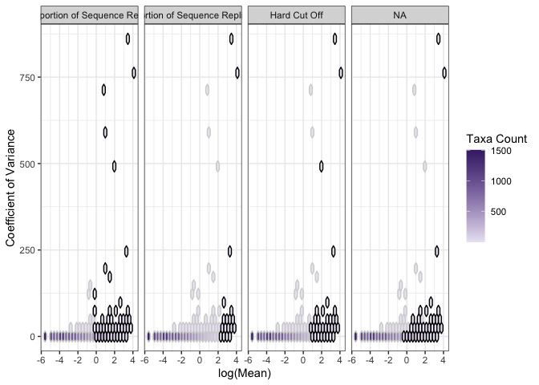

CoreMicro
=========

<!-- badges: start -->
<!-- badges: end -->
The goal of CoreMicro is to …

Installation
------------

You can install the released version of CoreMicro from
[CRAN](https://CRAN.R-project.org) with:

``` r
install.packages("CoreMicro")
```

Example
-------

This is a basic example which shows you how to solve a common problem:

``` r
library(CoreMicro)

arabidopsis %>% # use built in dataset
  combine_methods() %>% # create taxa presence absence table per core method
  combine_plots() # plot using hexbins
```

    ## [1] "tbl_df"       "tbl"          "data.frame"   "core_methods"


